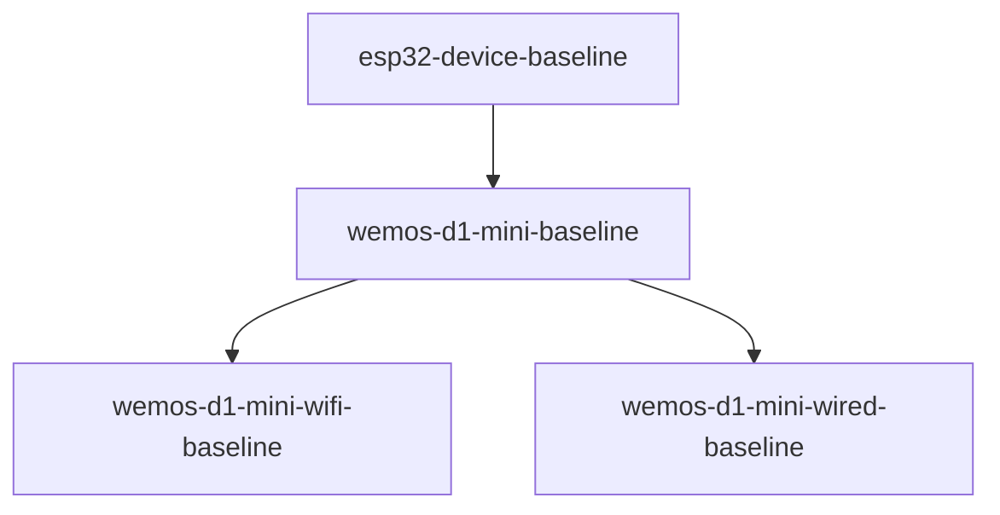

This is how the YAML is factored to make it easier to produce 'standardized' builds of various boards, where as much 'standarization' as possible is pushed to the lowest layer (topmost in this diagram).

Each layer specializes the previous layer.
