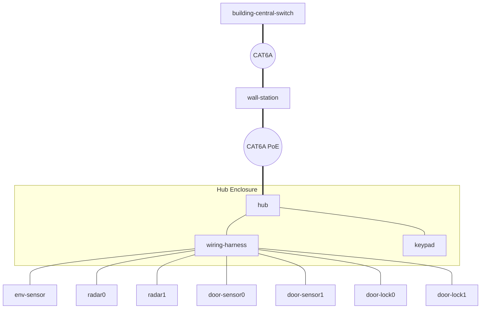

# sensor hub
Seems to me that a wired hub-and-spoke topology for a network of sensors is a much better setup than home-running a million wires to a central location, or using unreliable and slow WiFi.

